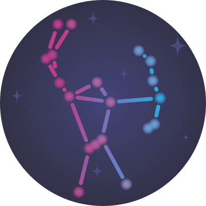

<a href="https://atlas.shubhranil.com" target="\_blank">

</a>

<div align="center">
  
</div>

<h1 align="center"><a href="https://orion.shubhranil.com">Atlas Orion</a></h1>
<p align="center">
    <strong>
      A two-in-one platform which showcases two major features. One is <a href="https://orion.shubhranil.com/kanban" target="_blank">Atlas-Kanban</a> which keeps track of all your tasks separated by boards. The other is <a href="https://orion.shubhranil.com/customers" target="_blank">Atlas-SSR</a> which generates a server-side rendered about page for you.
    </strong>
   <br /><br />
   <a href="https://github.com/alpha037/atlas-orion#readme"><strong>Explore the docs »</strong></a>
   <br />
   <br />
   <a href="https://github.com/alpha037/atlas-orion/issues">Report Bug</a>
   ·
   <a href="https://github.com/alpha037/atlas-orion/issues">Request Feature</a>
</p>

## Table of Contents

- [About](#about)
- [Built With](#built-with)
- [Getting Started](#getting-started)
  - [Building The Project](#building-the-project)
  - [Docker Instructions](#docker-instructions)
- [Functionality Overview](#functionality-overview)
- [Contributing](#contributing)
- [Current Issues](#current-issues)
- [License](#license)
- [Contact](#contact)

# About

This codebase was created to demonstrate a fully fledged two-in-one application built with [Angular 9](https://angular.io) that interacts with a Cloud Firestore database to handle CRUD operations to manage your tasks and boards in Atlas Kanban, authentication, routing, and also renders content using the Server-Side Rendering paradigm with the help of [Angular Universal](https://angular.io/guide/universal) for Atlas-SSR.

# Built With

This project has been built with:

- [Angular 9](https://v9.angular.io)
- [Cloud Firestore](https://firebase.google.com/docs/firestore)
- [Angular Universal](https://github.com/angular/universal)
- [Docker](https://www.docker.com/)
- [Google Cloud Run](https://cloud.google.com/run)
- [GCR](https://cloud.google.com/container-registry)

# Getting started

Make sure you have the [Angular CLI](https://github.com/angular/angular-cli#installation) installed globally. We use [npm](https://npmjs.com) to manage the dependencies, so we strongly recommend you to use it. After that, run `npm install` to resolve all dependencies (might take one minute or thirty depending on your network speed).

Run `npm run build:ssr` to build the application. After that, run `npm run serve:ssr` to serve your application. Then, navigate to `http://localhost:8080/` to see the application in action.

### Building the project

When you run `npm run build:ssr` , the build artifacts for the client application will be stored under the `dist/atlas-orion/browser` directory and the build artifacts for the server application will be stored under `dist/atlas-orion/server`.

### Docker Instructions

If you haven't installed [Docker](https://www.docker.com/products/docker-desktop) already, then you can get it from [here](https://www.docker.com/products/docker-desktop). After installing it, create an account in Docker and copy the username.

This application is already dockerized. You can pull the image directly from [docker hub](https://hub.docker.com/u/alpha037):

```bash
docker pull alpha037/atlas-orion:latest
```

**OR**

You can create your own by following the given steps.

To run the app in a docker container, follow the given steps:

- Clone this repository

  ```bash
  git clone https://github.com/alpha037/atlas-orion
  ```

- Navigate to the project directory
  ```bash
  cd atlas-orion
  ```
- Replace <strong>USERNAME</strong> with your own username and build the docker image
  ```bash
  docker build -t <USERNAME>/atlas-orion:1.0 .
  ```
- Open up the terminal at the project directory, replace <strong>USERNAME</strong> with your own username and run the following command:
  ```bash
  docker run -p 8080:8080 <USERNAME>/atlas-orion:1.0
  ```

# Functionality overview

There are mainly two major features in this application. In a nutshell, **Atlas-Kanban** is an oversimplified clone of [Trello](https://trello.com/en), and, **Atlas-SSR** is just some server sending you a page when you ask for it. (jokes apart)

**The general route breakdown looks like this:**

- Home page (URL: **/** )
  - About Atlas Orion
  - About Atlas-Kanban and Atlas-SSR
  - Justification of the name Atlas <i>Orion</i>
- Sign in/Login page (URL: **/login** )
  - Authentication and signing in/out users
- Kanban page (URL: **/kanban** )
  - Manage your tasks and boards as per your requirements
- Customer page (URL: **/customers** )
  - List of all the customers (or, users, if you will) who generated their about page with the help of our platform
  - Create your own about page
- Customer Detail page (URL: **/customers/:id** )
  - The actual server-side rendered about page of a customer (or, a user, if you will)

**Some important points:**

- All the feature modules are being [lazy loaded](https://angular.io/guide/lazy-loading-ngmodules).
- [Progressive Web App (PWA)](https://developer.mozilla.org/en-US/docs/Web/Progressive_web_apps) support is enabled for lower [First Contentful Paint (FCP)](https://developer.mozilla.org/en-US/docs/Glossary/First_contentful_paint) and of course, caching.

# Contributing

Contributions are what make the open source community such an amazing place to be learn, inspire, and create. Any contributions you make are **greatly appreciated**.

1. Fork the Project.
2. Create your Feature Branch (`git checkout -b feature/AmazingFeature`).
3. Commit your Changes (`git commit -m 'Add some AmazingFeature'`).
4. Push to the Branch (`git push origin feature/AmazingFeature`)
5. Open a Pull Request.

# Current Issues

Although this project works perfectly fine, however, there's a small caveat present. Currently, server-side rendering with [@nguniversal/express-engine](https://www.npmjs.com/package/@nguniversal/express-engine) and Angular 9 (or, server-side rendering in general with dynamic content) is a bit problematic because developers all around the globe are facing various [issues](https://github.com/angular/universal/issues) while injecting dynamic meta tags to make pages SEO friendly. Some of the fixes (or, hacks) suggested are working for some of the developers, but not for all. <br>

Needless to say, any help on this matter is highly appreciated. I'll even buy you a cup of coffee as a small token of appreciation! Thanks!

# License

Distributed under GNU AGPL 3.0. See [LICENSE](https://github.com/alpha037/atlas-orion/blob/main/LICENSE) for more information.

<!-- CONTACT -->

# Contact

Shubhranil Dutta - contact@shubhranil.com

Project Link: [https://github.com/alpha037/atlas-orion](https://github.com/alpha037/atlas-orion)
